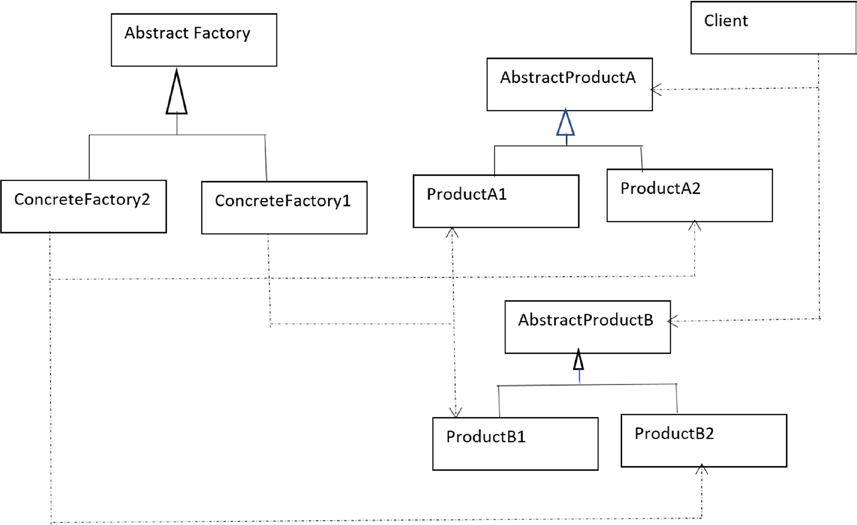

# Abstract factory example
Example taken from the book "Java Design Patters"
## Important points
* Create a concrete factory to create concrete objects
* Create object and factory abstractions to be implemented 
* Change the factory change the objects to be instantiated
```java
public static void main(String[] args) {
        AnimalFactory myAnimalFactory;
        Dog myDog;
        Tiger myTiger;
        System.out.println("***********DEMO***********");
        System.out.println("Wild");
        myAnimalFactory = new WildAnimalFactory();
        myDog = myAnimalFactory.createDog();
        myDog.speak();
        myDog.preferredAction();
        myTiger = myAnimalFactory.createTiger();
        myTiger.speak();
        myTiger.preferredAction();
        System.out.println("*********************");
        System.out.println("Pet");
        myAnimalFactory = new PetAnimalFactory();
        myDog = myAnimalFactory.createDog();
        myDog.speak();
        myDog.preferredAction();
        myTiger = myAnimalFactory.createTiger();
        myTiger.speak();
        myTiger.preferredAction();
    }
```
```
***********DEMO***********
Wild
I am a Wild Dog      
I run in the street  
I´m a wild Tiger     
I hunt in the jungle 
*********************
Pet
I am a Pet Dog       
I bark in my house   
I am a Pet tiger     
I sleep in my house 
```
## Structure of the pattern
