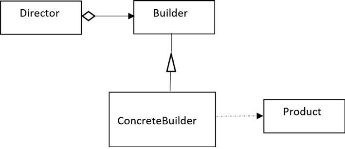

# Builder example
Example taken from the book "Java Design Patters"
## Important points
* Create a Director who controls the object construction process
* Implement different builders for different elements 
* The client **Only** interacts with the director
* The Builders can access to previously created objects
```java
public static void main(String[] args) {
        System.out.println("******Builder example DEMO*******");
        Director director = new Director();
        Builder renaultCar = new Car("Renault");
        Builder bmwMotorcyle = new MotorCycle("BMW");
        // Make the car
        System.out.println("***********CAR**********");
        director.construct(renaultCar);
        Product p1 = renaultCar.getVehicle();
        p1.showProduct();
        // Make the motorCycle
        System.out.println("***********MOTORCYCLE**********");
        director.construct(bmwMotorcyle);
        Product p2 = bmwMotorcyle.getVehicle();
        p2.showProduct();
    }
```
```
******Builder example DEMO*******
***********CAR**********
Completed product: 
Car model is: Renault
This is a body of the Car
4 wheels are added
2 Headlights are added
***********MOTORCYCLE**********
Completed product:
MotorCycle model is: BMW
This is a body of the MotorCycle
2 wheels are added
1 Headlights are added
```
## Structure of the pattern

> Taken from the book "Java Design Patters"