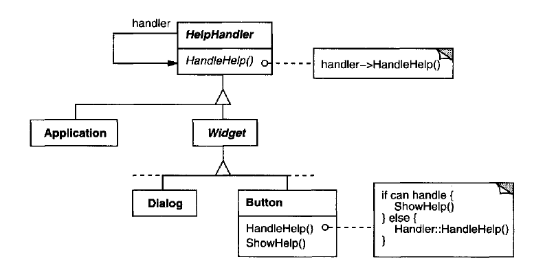

# Chain of responsibility
The idea of this pattern is to decouple senders and receivers by giving multiple
objects a chance to handle a request

## Important points
* Reduce coupling
* Added flexibility in assigning responsibilities to objects.
* Receipt isn't guaranteed.

## Motivation and usual problems
* Pass information until the more specific handler
* Multiple objects that have to handle the actions
* More than one object may handle a request
* Without specifying the receiver explicit
* The set of objects that can handle a request should be specified dynamically.
## Structure of the pattern

> Taken from the book "Java Design Patters"