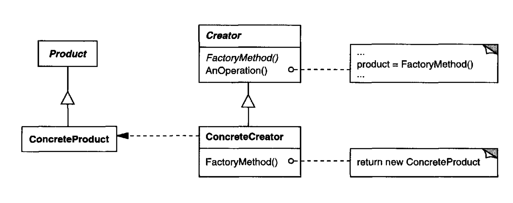

# Factoy Pattern 
Example taken from the book "Java Design Patters"

## Important points
* Delegate the object creation to factories
* Create a factory from an abstract form to create concrete objects
* keep things generals and try to use models 

## Motivation and usual problems
* **Complex objects need of factories**
* Delegate creational process make easier extend poducts and factories
* The client dont need to intereact with the concrete Product
## Demo code
```java
public static void main(String[] args) {
        System.out.println("***** DEMO  FACTORY*****");
        // create a Tiger factory
        AnimalFactory tigerFactory = new TigerFactory();
        Animal atiger = tigerFactory.createAnimal();
        atiger.Speak();
        atiger.Action();
        // Create a Dog factory
        AnimalFactory dogFactory = new DogFactory();
        Animal adog = dogFactory.createAnimal();
        adog.Speak();
        adog.Action();
    }
```
```
***** DEMO  FACTORY*****
Tiger says: Halum!!
Tiger jump!! 
Woof Woof
The dog walk
```

## Structure of the pattern

> Taken from the book "Java Design Patters"