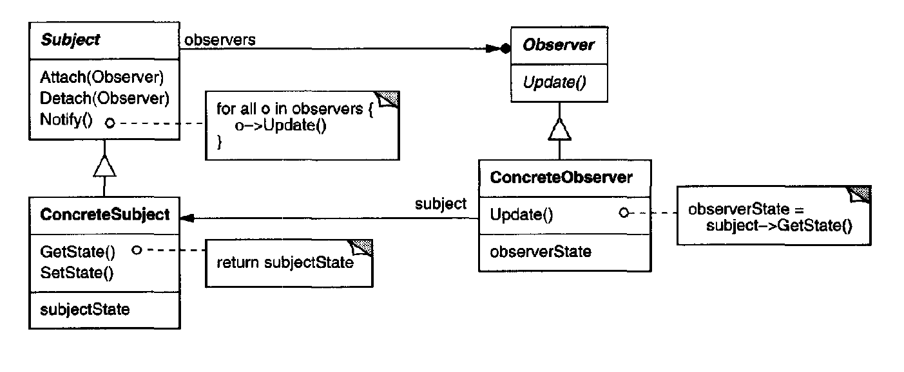

# Observer Pattern

Define objects tha receive information from other and update when this one change.

## Important points
* The update of an object affect others
* The observer and subject don't know each other
* An update of the subject affects **all** observers (cascade updates)

## Motivation and usual problems
* Subscription problems, update new objects
* Data streams to observers
* Notifications

## Structure of the pattern

> Taken from the book "Java Design Patters"