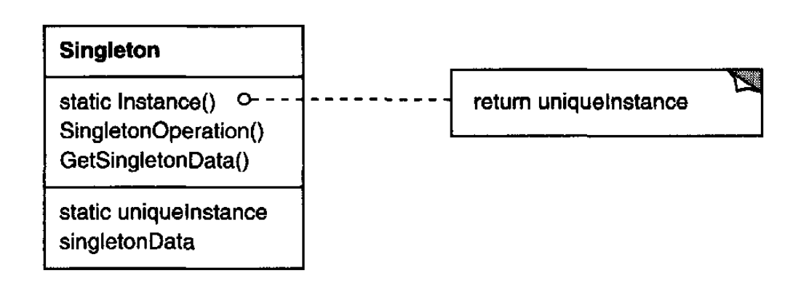

# Singleton Pattern
Create and access to just one instances of the class in the entiry application

## Important points
* Single connection or global instances 
* When the sole instance should be extensible by subclassing

## Motivation and usual problems
* Control access to the class
* Reduce name space
* Variable instance number
* More flexible class operations 
## Structure of the pattern

> Taken from the book "Java Design Patters"