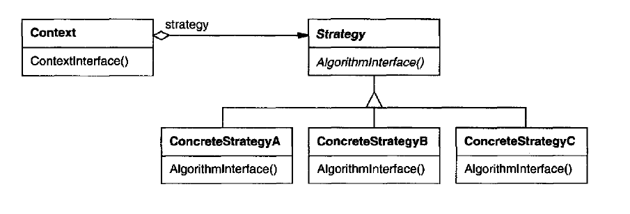

# Strategy Pattern
Implements the algorithm in different ways in different classes.

## Important points
* Different implementations of the same Behavioral in different classes using an implementation of an algorithm.
* The client class only decides which algorithm to use; the context class does not decide that.
* You can obtain different behaviors by changing the strategy in the context.

## Motivation and usual problems
* Different behavior in different implementations

## Structure of the pattern

> Taken from the book "Java Design Patters"