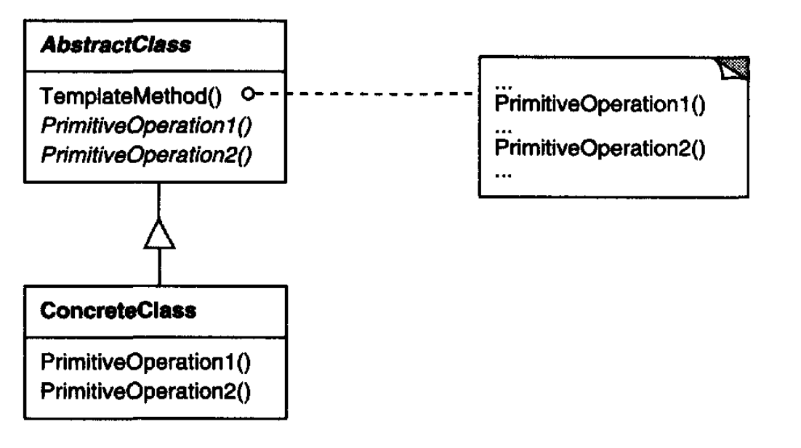

# Template 
Allow us to create differnet implementation of a part of an algorithm dividing the operation in steps to be implemented.

## Important points
* A main algorith with specific steps to be changed.
* Allow differntes implementation of complex algorithms

## Motivation and usual problems
* Define the skeleton of an algorithm in an operation, deferring some steps to subclasses.
* Problems where the algorith only differs in some steps
## Structure of the pattern

> Taken from the book "Java Design Patters"